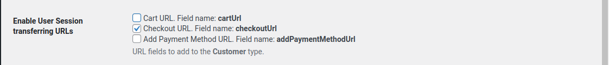
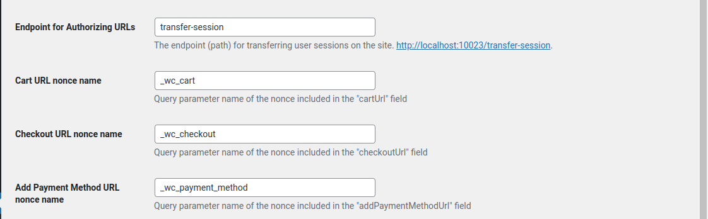

# Harmonizing with WordPress

In our [previous section](using-cart-data.md), we created a cart page for our WooCommerce store. Now, we are going to add a "Checkout" button to this page and discuss how to ensure the security of the process.

Our checkout button's `href` attribute will be a nonced URL that directs the user to a particular endpoint on the WP backend. The endpoint performs a set of operations such as validating the URL, loading the WooCommerce session, authenticating the registered user, and redirecting to the checkout page. If the URL validation fails, the user will be redirected to the WP homepage.

## Enabling Dedicated Router and Nonce Generation

Before starting with the checkout button creation, we need to activate the dedicated router and nonce generation feature introduced in WooGraphQL v0.13.0. To do this, enable the "User Session transferring URLs" option in your WooGraphQL settings. Also, make sure to check the "Checkout URL" checkbox under this option.



Although it's not mandatory, it's recommended to set the "Endpoint for Authorizing URLs" and "Checkout URL nonce name" settings with secure values for increased security.



## Creating the Checkout Button

To create a checkout button in our CartPage component, we can use the `checkoutUrl` field from the `customer` query. This URL is dynamically generated by our GraphQL server and is now ready for use. Let's update our CartPage component:

```jsx
// ...existing code...
<a className="button" href={customer.checkoutUrl}>Checkout</a>
// ...existing code...
```

## Understanding URL Validation and Security

Although our checkout button is now functional, it's important to note that the default URL validation process can be improved in terms of security. In the next part of this section, we will discuss the security measures and how to enhance them.

### Improving Security with Client Session ID

The first step is to create a "Client Session ID" in our app and pass it to the WooCommerce session using the `updateSession` mutation. This mutation allows us to set session metadata directly in the WooCommerce session data object. The `client_session_id` meta is used by WooGraphQL to create the nonce.

If WooGraphQL cannot find this meta, it generates one on the server, making the URL potentially usable on any machine. This is why it's important to avoid an arbitrary string as the session ID. Instead, we should use a value tied to the user's machine, like their IP or User Agent. Afterward, this value should be one-way hashed for increased security.

Furthermore, we also need to set the `client_session_id_expiration` as a string value representing the expiration time in seconds. For example, to set an expiration time of one hour from now, we could use: `Math.floor(new Date().getTime() / 1000) + 3600`.

We can achieve all of this by using the `updateSession` mutation as follows:

```graphql
mutation($input: UpdateSessionInput!) {
    updateSession(input: $input) {
        customer {
            checkoutUrl
        }
    }
}
```

With the input fields populated with secure values:

```js
const input = {
    sessionData: [
        {
            key: 'client_session_id',
            value: 'secure_hashed_value', // Replace this with your secure hashed value.
        },
        {
            key: 'client_session_id_expiration',
            value: `${Math.floor(new Date().getTime() / 1000) + 3600}`,
        },
    ]
}
```

When the `client_session_id` or `client_session_id_expiration` values become invalid or expired, WooGraphQL generates new values with an expiration time of one hour. To avoid this, we recommend that you periodically update these values from the client side and retrieve a new `checkoutUrl` each time.

## Reinventing Security: The Client-Side Nonce

Next we're going to explore an advanced approach to enhance the security of our checkout procedure by generating a nonce on the client side. By doing this, and not pulling the Nonces or Auth URLs from WooGraphQL we remove any risk of leakage thru GraphQL request and further protect the end-user's data and the WordPress backend. This process will involve recreating some PHP and WordPress core functions in JavaScript.

1. **PHP `time` Function in JavaScript**

   Our first stop is to rewrite the PHP `time` function in JavaScript, which returns the current Unix timestamp. Here's how we can do it:

    ```js
    function time() {
      return Math.floor(new Date().getTime() / 1000);
    }
    ```

2. **WordPress `wp_nonce_tick` Function in JavaScript**

   Next, we translate the WordPress function `wp_nonce_tick` to JavaScript. This function returns a time-dependent variable for nonce creation:

    ```js
    const MINUTE_IN_SECONDS = 60;
    const HOUR_IN_SECONDS = 60 * MINUTE_IN_SECONDS;
    const DAY_IN_SECONDS = 24 * HOUR_IN_SECONDS;

    function nonceTick() {
      const nonceLife = DAY_IN_SECONDS;
      return Math.ceil(time() / (nonceLife / 2));
    }
    ```

3. **WordPress `wp_hash` Function in JavaScript**

   The `wp_hash` function, another WordPress core function, will be adapted to JavaScript as well. This function uses the `wp_salt` function to retrieve the salt from WordPress Salt constants, usually defined in the `wp-config.php` file. In our context, we only need the `nonce` salt. Therefore, it's crucial to ensure the `NONCE_KEY` and `NONCE_SALT` constants are set on the WordPress installation and their values are accessible in our front-end application.

   `wp_hash` also uses `hash_hmac` and `md5` encryption to create the hash. For this, we'll utilize `crypto-js`, which you can install with `npm` using the command `npm install crypto-js`. Here's how to write `wp_hash` in JavaScript:

    ```js
    import { HmacMD5 } from 'crypto-js';

    export function wpNonceHash(data) {
      const nonceSalt = process.env.NONCE_KEY + process.env.NONCE_SALT;
      const hash = HmacMD5(data, nonceSalt).toString();

      return hash;
    }
    ```

With these functions ready, we can essentially recreate the `woographql_create_nonce` PHP function employed by WooGraphQL to create the nonce. Below is the JavaScript version:

```js
export function createNonce(action, uId, token) {
  const i = nonceTick();

  const nonce = wpNonceHash(`${i}|${action}|${uId}|${token}`).slice(-12, -2);

  return nonce;
}
```

In the function above:
- The `action` parameter represents the nonce action name.
- The `uId` parameter represents the end-user's session ID - either their WP User Database ID (if they are authenticated) or a random string (if they are a guest). To retrieve this value, we'll have to decode the WooCommerce Session Token used by ApolloClient.
- The `token` is our Client Session ID mentioned earlier.

4. **Generating the URLs**

Having the nonce alone is not enough, so let's move on to generating our URLs. The process involves three functions and the `jwt-decode` library. Install it using npm with the command `npm install jwt-decode`.

Here's the JavaScript code to generate the URL:

```js
import jwtDecode from 'jwt-decode';

function getAction(action, uId) {
  switch (action) {
    case 'cart':
      return `load-cart_${uId}`;
    case 'checkout':
      return `load-checkout_${uId}`;
    case 'new-payment':
      return `load-account_${uId}`;
    case 'change-sub':
      return `change-sub_${uId}`;
    case 'renew-sub':
      return `renew-sub_${uId}`;
    default:
      throw new Error('Invalid nonce action provided.');
  }
}

function getNonceParam(action) {
  switch (action) {
    case 'cart':
      return '_wc_cart';
    case 'checkout':
      return '_wc_checkout';
    case 'new-payment':
      return '_wc_payment';
    case 'change-sub':
      return '_wc_change_sub';
    case 'renew-sub':
      return '_wc_renew_sub';
    default:
      throw new Error('Invalid nonce action provided.');
  }
}

export function generateUrl(sessionToken, clientSessionId, actionType) {
  const decodedToken = jwtDecode(sessionToken);
  if (!decodedToken?.data?.customer_id) {
    throw new Error('Failed to decode session token');
  }
  const uId = decodedToken.data.customer_id;
  const action = getAction(actionType, uId);

  // Create nonce
  const nonce = createNonce(action, uId, clientSessionId);

  // Create URL.
  const param = getNonceParam(actionType);
  let url = `${process.env.WORDPRESS_URL}/transfer-session?session_id=${uId}&${param}=${nonce}`;

  // Add subscription ID placeholder if subscription action.
  if (actionType === 'change-sub' || actionType === 'renew-sub') {
    url = `${url}&sub=%SUBSCRIPTION_ID%`;
  }
  
  return url;
}
```

Note that for the `change-sub` and `renew-sub` actions from WooGraphQL Pro, we are passing a `%SUBSCRIPTION_ID%` placeholder to be replaced with a subscription database ID before use.

To get our checkout URL, you would run:

```js
const checkoutUrl = generateUrl(sessionToken, clientSessionId, 'checkout');
```

Also, `transfer-session` is the default name of the authorization endpoint. This can be altered in the WooGraphQL settings on the WP Dashboard.

To confirm the validity of your URL, compare it with the Auth URLs generated by WooGraphQL with the same `client_session_id` and ensure they are identical.

## Conclusion

With this section, you should now be able to add a secure checkout button to your WooCommerce cart page using WooGraphQL. Keep in mind that even though we've improved security by setting a client-side session ID and expiration, these measures should be part of a broader security strategy. Always ensure to follow best practices to keep your application and user data safe.
