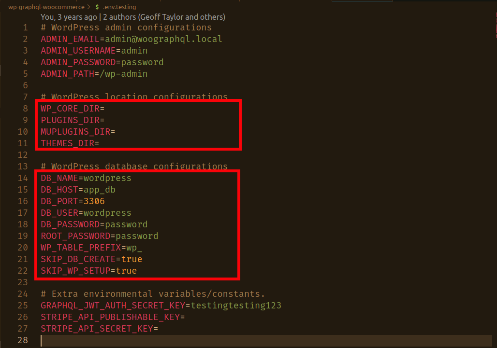
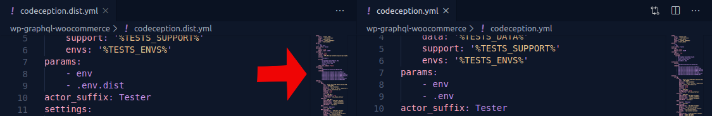
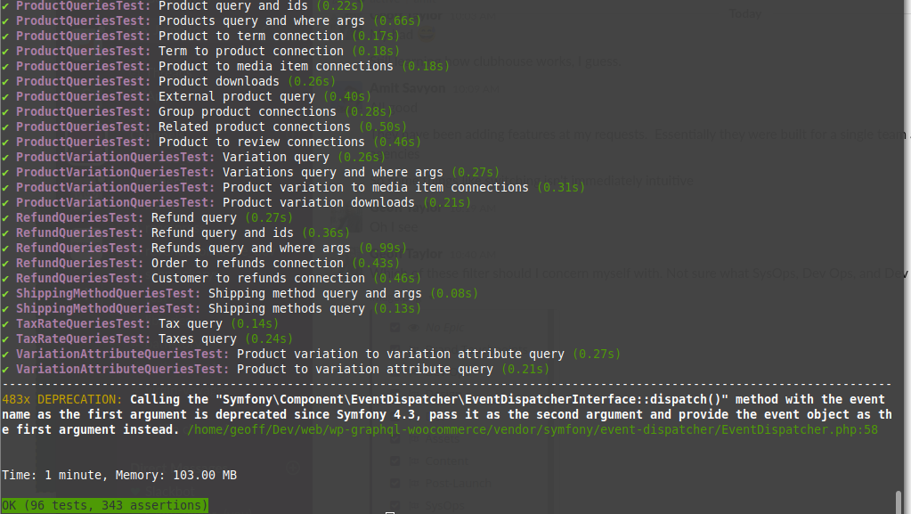
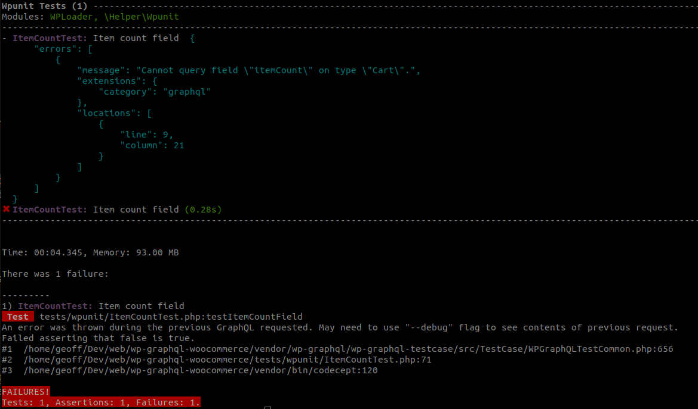
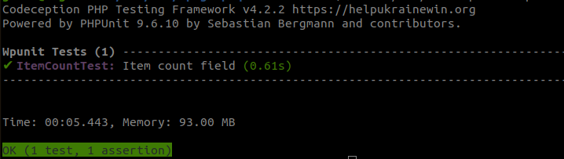
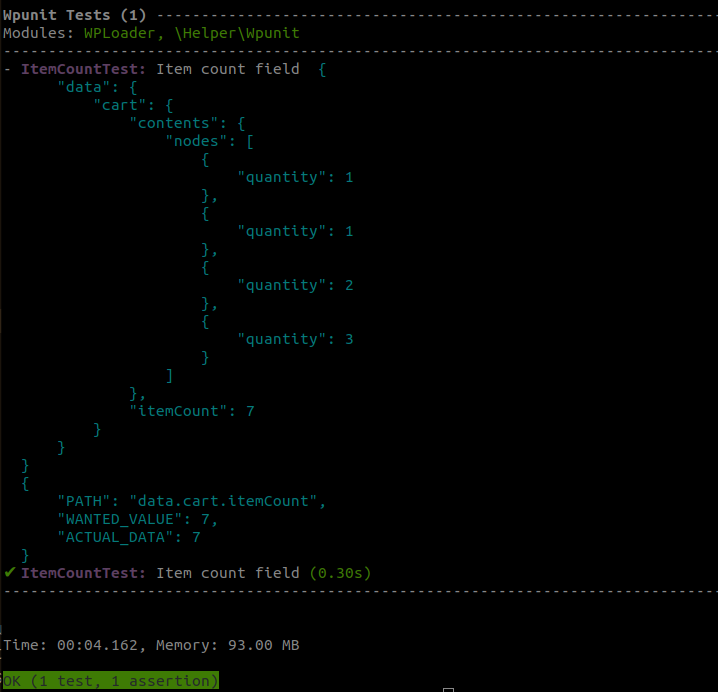

# Local CLI Testing

Editing the **WPGraphQL** API can be tricky at times, even more so when dealing with a massive plugin like WooCommerce.
Don't let this discourage you though, it's possible simplify this development process with some application of **Test-Driven Development (TDD)**. Now if you've ever been told anything about **TDD**, it's probably that **TDD** doesn't always fit everyone's development process. Nonetheless, the argument I'm trying to make is here is that using **TDD** and following this guide, you'll learn how to make proper changes to the **WPGraphQL/WooGraphQL** schema as well as write code that you know works regardless of where the GraphQL request came from or where the WPGraphQL server is installed.

## Codeception & the wp-browser module

**WPGraphQL** and **WooGraphQL** both use the **[Codeception](https://codeception.com/)** testing framework alongside the **[wp-browser](https://wpbrowser.wptestkit.dev/)** module created by [Luca Tumedei](https://www.theaveragedev.com/) for running the automated test suite. We'll be using Codeception scaffolding to generate all the tedious test code, but this will not be an in-depth guide on either of these libraries. It's not required to process with this tutorial, but it's highly recommended that after finishing this tutorial you take a look at the documentation for both.

- **[Codeception](https://codeception.com/docs/01-Introduction)**
- **[wp-browser](https://wpbrowser.wptestkit.dev/)**

## Setting up WordPress for testing

Before we can begin testing we need a local WordPress installation. If you already have a local installation for development that you wish to use, make a backup database for testing and skip to **[Setting up Codeception](#settingupcodeception)**. If you don't have a local installation or simply don't want to risk your local installation, you can use the scripts provided by **WPGraphQL** and **WooGraphQL** to create one for testing in a temporary directory.

### Prerequisties

Have **PHP**, **MySQL** or **PostgreSQL**, **Composer**, and **[WP-CLI](https://wp-cli.org/)** installed as well as terminal/shell/command-line access.

1. Start by cloning **[WooGraphQL](https://github.com/wp-graphql/wp-graphql-woocommerce)**.
2. Open your terminal.
3. Copy the `.env.dist` to `.env` by execute the following in your terminal in the **WooGraphQL** root directory.

    ```bash
    cp .env.testing .env
    ```

4. Open the .env and update the second group of boxed environmental variables in the image below to match your machine setup. If you're on Windows __(Not WSL)__ you'll have to set the first boxed group as well because by default the installation location is `./local/public` within the plugin directory is used, and Windows does not support symlink/shortcuts being nested inside their destination.

5. Last thing to do is run the WordPress testing environment install script in the terminal.

    ```bash
    composer install-test-env
    ```

This will create and configure a WordPress installation in a temporary directory for the purpose of testing.

## Setting up Codeception

Now that we have setup our testing environment, let's run the tests. To do this we will need to install the **Codeception** and the rest of our **devDependencies**

1. First run `composer installTestEnv` in the terminal.
2. Next copy the `codeception.dist.yml` to `codeception.yml`

    ```bash
    cp codeception.dist.yml codeception.yml
    ```

3. Open `codeception.yml` and make the following changes.


Now you all set to run the tests locally.

## Running the tests

Now we're ready to get started with testing. There is a small issue you may have with our testing environment. The WordPress installation we created doesn't support **end-to-end (*e2e*)** testing, however this won't be a problem. **WPGraphQL** is an API and most of the time you can get away with just ensuring that your query works, and **WPGraphQL** provides a few functions that will allow us to do just that.

Well, let's get started by running all the unit tests. Back in your terminal run the following:

```bash
vendor/bin/codecept run wpunit
```

If everything is how it should be you should get all passing tests.


## Writing your first WooGraphQL and WPGraphQL WPUnit test

This rest of this guide walk through creating a competent WPUnit test and implemented the functionality needed to ensure that test passed. For the most part everything used here can be used when making changes to WPGraphQL as well as many of the WPGraphQL extensions created by @jasonbahl, myself and the WPGraphQL community.

The functionality we'll be adding in the coming steps will be to add the **Integer** field `itemCount` on the **Cart** object type. To do this we'll be.

1. **Generating a WPUnit test file** Now typically for a feature so small it would be enough to update the first test in the **CartQueriesTest** class to include the desired `itemCount` field, however to the purpose of this guide we'll be creating a new test file named **ItemCountTest**.
2. **Writing our test** The name says it all.
3. **Run the test expecting failure** The purpose of this step will be used to introduce to **WPGraphQL**'s Error Reporting and the `codecept_debug` function.
4. **Implementing our changes** This step will do some exploring into how **WooGraphQL** and **WPGraphQL** work behind the scenes, and diving in to some key components. After acquiring a grasp of WPGraphQL execution implementing the desired changes with be trivially.
5. **Run test expecting success** The final step will be to the **ItemCountTest** looking for success this time.

### Generating a WPUnit test file

The PHP testing suite used by WPGraphQL and WooGraphQL is Codeception, but they don't manage the `codeception/codeception` in **Composer**. That is done by the `lucatume/wp-browser` package. This package, developed and maintained by *[theAverageDev](http://theaveragedev.com/)* [Luca Tumedei](https://github.com/lucatume), **[wp-browser](https://wpbrowser.wptestkit.dev/)** is a suite of Codeception modules that provide tools designed specifically for testing WordPress sites, themes, and plugins on multiple levels. The `lucatume/wp-browser` package functions as a one-stop shop managing Codeception and all it's dependencies for WPGraphQL and many of it's extensions.

So having done everything above, and finally being ready for development, begin by generating the **ItemCountTest** test file with Codeception `generate` command. Run the following in your terminal from the project root directory

```bash
vendor/bin/codecept generate:wpunit wpunit "ItemCount"
```

This will generate a new test file at `tests/wpunit/ItemCountTest.php`. The `generate` is an easy-to-use tool of convience. You learn more about [here](https://codeception.com/for/wordpress).

The `ItemCountTest.php` file should be a familiar site to anyone whose used Codeception or PHPUnit *(which Codeception is built on)*.

```php
<?php

class ItemCountTest extends \Codeception\TestCase\WPTestCase
{

    public function setUp(): void {
        // before
        parent::setUp();

        // your set up methods here
    }

    public function tearDown(): void {
        // your tear down methods here

        // then
        parent::tearDown();
    }

    // tests
    public function testMe()
    {
    }
}
```

#### setUp()/tearDown() and others

This functions execute before and after every function. The `setUp()` in particular is perfect place to create objects such posts, products, orders, etc to test with as well as set any WordPress options that maybe needed or interfere with the tests. The `tearDown()` is good for deleting things that Codeception and wp-browser miss, which isn't much so it not uncommon for the function to be left an empty stub.

There's also the `wpSetUpBeforeClass( $factory )` and `wpTearDownAfterClass( $factory )` that are run before all the tests, however their use-case is even move rare then `tearDown()` on account that these methods are static and don't have access to the same `$this` context as the `setUp()`, `tearDown()` or `test*()` function.

#### test*() functions

Class functions that are prefix with `test` are tests. These functions are run on isolation for the most part. Test function must be `public` access. The purpose of the test function is to confirm the correct data is provided by when requested. This is done using the `Assert` library provided by **PHPUnit** which is wrapped by the **Codeception** framework and used by will everything on top of it.

```php
$this->assertEquals( array( 5 ), [ 5 ] );
```

#### Extending the `WooGraphQLTestCase` class

Now that we've gone over the basic functions of a Unit test let's go ahead and modify it for a needs.

```php
<?php

use Tests\WPGraphQL\WooCommerce\TestCase\WooGraphQLTestCase;

class ItemCountTest extends WooGraphQLTestCase {

    // tests
    public function testMe()
    {
    }
}
```

Here we'll be utilizing a `WooGraphQLTestCase` bundled in the WooGraphQL test environment. It extends the WPGraphQLTestCase class provided by the [**WPGraphQL TestCase**](https://github.com/wp-graphql/wp-graphql-testcase) library. Which was designed specifically for testing WPGraphQL responses.

### Writing our test

Making changes to GraphQL API is always a rather top-down affair, meaning you'll have an idea of how you want the query to look before you have an idea of how you want the implementation to look. For example the query in relation to the changes we want to make will be as follows.

```graphql
query {
    cart {
        contents {
            nodes {
                quantity
            }
        }
        itemCount
    }
}
```

Nothing special, but if you sent this query to the WPGraphQL server you'd get back.

```json
{
  "errors": [
    {
      "message": "Cannot query field \"itemCount\" on type \"Cart\".",
      "extensions": {
        "category": "graphql"
      },
      "locations": [
        {
          "line": 8,
          "column": 5
        }
      ]
    }
  ],
}
```

Which shouldn't be surprising, in the next section we'll be taking this query and creating our test around it.


> If you didn't already know, an `itemCount` field already exist. It just happens to be under the `contents` connection as a field you can access it like this.
>```graphql
>query {
>   cart { contents { itemCount } }
>}
>```

#### WooGraphQL Codeception Factories

WooCommerce is a vast WordPress plugin with a lot moving parts and getting them all to play nice can be a daunting task. To address this the **WooGraphQLTestCase** class provides a number of factories for creating just the right scenario for testing our queries. In this guide you'll be expose to the `cart` and `product` factories, but there are quite a few. However documentation on them is pretty non-existant at the time of creation for this guide. Until this is rectified, it's recommended that you view factory [files](https://github.com/wp-graphql/wp-graphql-woocommerce/tree/develop/tests/_support/Factory) directly to get a general idea of what they are and their capabilities.

#### Setting up our scenario

Let's finish begin writing out test by creating our scenario with the `setUp()`. Our scenario for this is test is rather simple, our query just need some products and those products have to be in the cart. Using `product` and `cart` helpers we can do this in a few lines of code.

```php
public function testMe() {
    // Our scenario
    $products = [
        [
            'product_id' => $this->factory->product->createSimple(),
            'quantity'   => 1,
        ],
        [
            'product_id' => $this->factory->product->createSimple(),
            'quantity'   => 1,
        ],
        [
            'product_id' => $this->factory->product->createSimple(),
            'quantity'   => 2,
        ],
        [
            'product_id' => $this->factory->product->createSimple(),
            'quantity'   => 3,
        ],
    ];

    $this->factory->cart->add( ...$products );
}
```

And that's it, scenario created. You maybe confused, but we'll break it down.

```php
$products = [
    [
        'product_id' => $this->factory->product->createSimple(),
        'quantity'   => 1,
    ],
    [
        'product_id' => $this->factory->product->createSimple(),
        'quantity'   => 1,
    ],
    [
        'product_id' => $this->factory->product->createSimple(),
        'quantity'   => 2,
    ],
    [
        'product_id' => $this->factory->product->createSimple(),
        'quantity'   => 3,
    ],
];
```

The `$product` array holds the `product_id`s and `quantity`s of products being add to our cart. `createSimple( $args = array() )` creates a new simple product with a random name and price and returns the `product_id` of the newly created product. There are `createExternal( $args = array() )`, `createGrouped( $args = array() )` and `createVariable( $args = array() )`, as well as many more create functions for creating other objects related to products.

```php
$this->factory->cart->add( ...$products );
```

And finally, you have probably figured out that this adds the products in `$products` to the cart. `cart` factory functions as a glorified wrapper for the `WC()->cart` instance with a extra features for testing.

Now that our scenario is set. Let's get to are test. We'll start by change the name of the test to `testItemCountField` and assign our query to a string variable.

```php
public function testItemCountField() {
    // Our scenario
    ...

    $query = '
        query {
            cart {
                contents {
                    nodes {
                        quantity
                    }
                }
                itemCount
            }
        }
    ';
}
```

Simple enough, next we'll run our query through WPGraphQL using `graphql( $request_data = [] )`.

```php
public function testItemCountField() {
    // Our scenario
    ...

    $response = $this->graphql( [ 'query' => $query ] );
}
```

`$this->graphql()` is a simple wrapper for the `graphql()` function provided by WPGraphQL. It will process a GraphQL request and return the results as an associative array. This makes it a great tool for testing our queries.

Another this about the wrapper is if the `--debug` flag is passed when using Codeception's `run` command, the response from `graphql()` is pretty printed to the console. Its use here is great because when we run our test later in debug mode we'll know exactly what WPGraphQL is returning for our query.

The last step in our test is to confirm the we received the correct values for our `itemCount` field.

```php
public function testItemCountField() {
    // Our scenario
    ...

    $expected = [
        $this->expectedField(
            'cart.itemCount',
            array_sum( array_column( $products, 'quantity' ) )
        ),
    ];
    $this->assertQuerySuccessful( $response, $expected );
}
```

And that's our test. You notice we're only testing our new field with the `expectedField` function and nothing else the query may have returned. That's the primary purpose of **WPGraphQL TestCase**. It provides functions like `expectedField` and `expectedNode` to isolate and test the parts of the query you care about and ignore everything else. This will save you from the hell that comes from testing groups of nodes that come in an order you've not predicted in your test.

```php
<?php

use Tests\WPGraphQL\WooCommerce\TestCase\WooGraphQLTestCase;

class ItemCountTest extends WooGraphQLTestCase {

    // tests
    public function testItemCountField() {
        // Our scenario
        $products = [
            [
                'product_id' => $this->factory->product->createSimple(),
                'quantity'   => 1,
            ],
            [
                'product_id' => $this->factory->product->createSimple(),
                'quantity'   => 1,
            ],
            [
                'product_id' => $this->factory->product->createSimple(),
                'quantity'   => 2,
            ],
            [
                'product_id' => $this->factory->product->createSimple(),
                'quantity'   => 3,
            ],
        ];

        $this->factory->cart->add( ...$products );

        $query = '
            query {
                cart {
                    contents {
                        nodes {
                            quantity
                        }
                    }
                    itemCount
                }
            }
        ';

        $response = $this->graphql( [ 'query' => $query ] );
        $expected = [
            $this->expectedField(
                'cart.itemCount',
                array_sum( array_column( $products, 'quantity' ) )
            ),
        ];
        $this->assertQuerySuccessful( $response, $expected );
    }
}
```

### Run the test expecting failure

Now that the test is created, we will run it expecting failure and using the `--debug` flag.

```bash
vendor/bin/codecept run wpunit ItemCountTest --debug
```

Running this statement in the terminal will make Codeception run just the `ItemCountTest` in debug mode. This way we can see exactly WPGraphQL returns for our query.


Running the test will result in the error above. **Cannot query field "itemCount" on type "Cart".** The error is quite easy to understand. We cannot query a field that doesn't yet exist.

### Adding the `itemCount` field to the GraphQL schema

Before when jump into the code, lets discuss how WPGraphQL and WooGraphQL process requests.

#### How WPGraphQL works

When a request is made to Wordpress, during the `after_setup_theme` action **WPGraphQL** initializes the [`Router`](https://github.com/wp-graphql/wp-graphql/blob/develop/src/Router.php) class which is in-charge of determining whether the request is a GraphQL request and acting accordingly.
If the request is a GraphQL request, a [`Request`](https://github.com/wp-graphql/wp-graphql/blob/develop/src/Request.php) class instance is created. It's job is to load the schema and process the request.
The first part of loading the schema and our focal point for purpose is the initialization of the [`TypeRegistry`](https://github.com/wp-graphql/wp-graphql/blob/develop/src/Registry/TypeRegistry.php) and specific the execution of [`graphql_register_types`](https://github.com/wp-graphql/wp-graphql/blob/develop/src/Registry/TypeRegistry.php#L397) action. This hook serves the purpose of providing a location to register types not defined by **WPGraphQL**.

#### How WooGraphQL works

WooGraphQL uses `graphql_register_types` to register WooCommerce specific types.
If you're familiar WordPress, you're most like familiar with Custom Post-types _(CPTs)_ the core data object used by WordPress. If you're not too familiar with WooCommerce, _(or even if you are)_, you maybe wondering why the CPTs in WooCommerce have such a different schema shape the CPTs defined by **WPGraphQL**. This due to the fact the WooCommerce wraps it's CPT objects, _(WP_Post)_, in data stores objects. This data stores provide decorator functionality that is widely used by WooCommerce extension. **WooGraphQL** uses data stores as the source for it CPT schema shapes. All other types like the **cart** and **shipping zones** are sourced by custom data objects saved in custom databases, and accessed using WooCommerce built-in functionality.

#### Implementing our changes

Now to implement our changes we simply need to register our `itemCount` field to the `Cart` object type.

```php
register_graphql_field(
    'Cart',
    'itemCount',
    [
        'type'        => 'Int',
        'description' => __( 'Total number of items in the cart.', 'wp-graphql-woocommerce' ),
        'resolve'     => function( \WC_Cart $source ) {
            $items = $source->get_cart();
            if ( empty( $items ) ) {
                return 0;
            }

            return array_sum( array_column( $items, 'quantity' ) );
        },
    ],
);
```

Simple enough, right. Now we can slap this at the end of the `TypeRegistry` and it would fine, however for a pull request that wouldn't work. So let's include this the inside the `register_graphql_object_type()` call for the `Cart` type with the rest of `Cart` fields. This call can be found in `Cart_Type::register_cart()` in `includes/type/object/class-cart-type.php`.

```php
    /**
     * Registers Cart type
     */
    public static function register_cart() {
        register_graphql_object_type(
            'Cart',
            array(
                'description' => __( 'The cart object', 'wp-graphql-woocommerce' ),
                'fields'      => [
                    ... // Other cart fields
                    'itemCount' => [
                        'type'        => 'Int',
                        'description' => __( 'Total number of items in the cart.', 'wp-graphql-woocommerce' ),
                        'resolve'     => function( \WC_Cart $source ) {
                            $items = $source->get_cart();
                            if ( empty( $items ) ) {
                                return 0;
                            }

                            return array_sum( array_column( $items, 'quantity' ) );
                        },
                    ],
                ],
            )
        );
    }
```

And :boom:! Changes made. Let's run our test!!

### Run test expecting success

Now if you re-run `vendor/bin/codecept run wpunit ItemCountTest`


And we have passed, and if we want to see our query response use the `--debug` flag



## Going Forward

If you have already, you should at least take a look at the following

- Documentation on extending **WPGraphQL**. [Here](https://docs.wpgraphql.com/extending/types/).
- **WooCommerce** REST API [Docs](https://woocommerce.github.io/woocommerce-rest-api-docs), seeing as it has been and continues to be the base template for the **WooGraphQL** schema.

If you plan on contributing you should see the following as both **WPGraphQL** and **WooGraphQL** uses them.

- **Codeception** [Docs](https://codeception.com)
- **wp-browser** [Docs](https://wpbrowser.wptestkit.dev/)