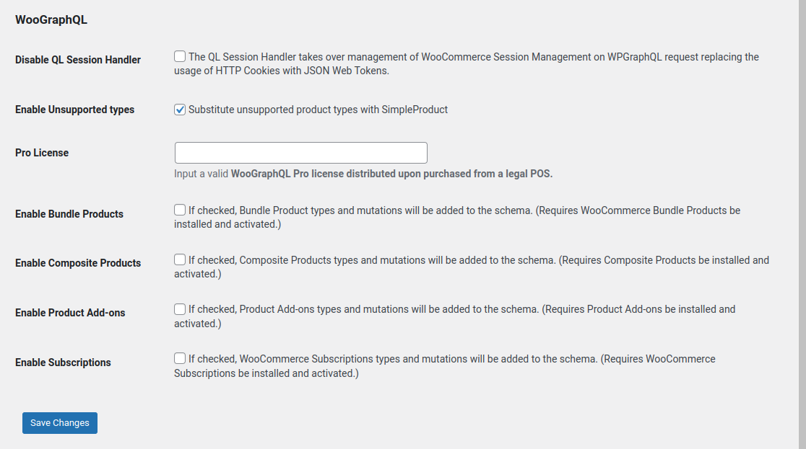
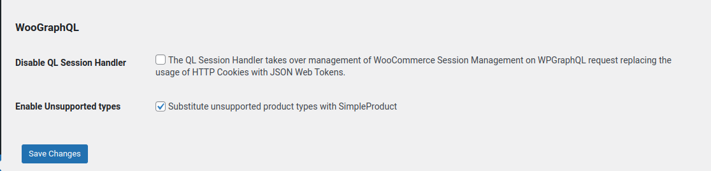
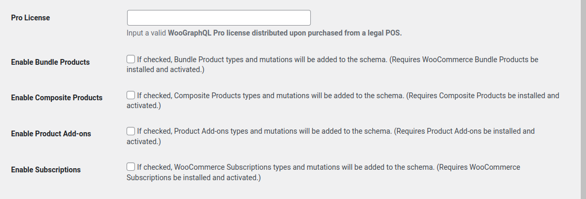

<!--
title: "WPGraphQL for WooCommerce Settings Guide"
description: "Learn how to configure and manage WPGraphQL for WooCommerce settings to optimize the integration of WooCommerce with WPGraphQL for your headless e-commerce solution."
keywords: "WooGraphQL, WPGraphQL, WooCommerce, GraphQL, settings, configuration, headless e-commerce"
author: "Geoff Taylor"
-->

# WPGraphQL for WooCommerce Settings

The WPGraphQL for WooCommerce settings tab on the WPGraphQL settings page provides several options to customize the behavior of the WPGraphQL for WooCommerce plugin. Below is a detailed breakdown of each setting.

## Disable QL Session Handler

WPGraphQL for WooCommerce comes with a custom WooCommerce User Session Handler called QL Session Handler, which extends the default WooCommerce session handler. The QL Session Handler uses JSON Web Tokens (JWT) instead of HTTP cookies for session identification. This setting allows you to disable the QL Session Handler and revert to the default WooCommerce session handler that uses HTTP cookies.

### Default WooCommerce Session Handler

The default WooCommerce User Session Handler is responsible for capturing cart and customer data for end-users and storing it temporarily in the WordPress database. It provides an HTTP cookie to the end-user's machine to keep track of this session, even if they aren't a registered member of the WordPress site. The session typically stays in the database for 14 days from its last save, after which it is deleted. The problem with HTTP cookies is that they typically cannot be used across multiple domains without complex configurations.

## Enable QL Session Handler on WC AJAX / WP REST Requests

These two settings extend the QL Session Handler's JWT-based session identification to WooCommerce AJAX requests and WordPress REST API requests respectively. Enable these if your headless application also interacts with WC AJAX or REST endpoints and needs consistent session handling.

## Session Token Type

Choose which session token type(s) to generate:

- **Legacy** — GraphQL session tokens only (default).
- **Store API** — WooCommerce Blocks Cart-Token only (requires WooCommerce 5.5.0+).
- **Both** — Generates both token types for maximum compatibility with headless implementations that use WooCommerce Blocks alongside GraphQL.

## Session Transfer Behavior

Controls how cart data is handled when a user logs in with an existing session from another device:

- **Keep new, fallback to old** — Keeps the current session data if non-empty, otherwise restores the previously saved session (default).
- **Keep new** — Always uses the current session data.
- **Keep old** — Restores the previously saved session data, discarding the current session.

## Transliterate Non-Latin Characters

Converts non-latin characters (Cyrillic, Chinese, Arabic, etc.) to their latin equivalents in GraphQL type and enum names. Enable this if your WooCommerce tax classes, product attributes, or taxonomies use non-latin names. Requires the PHP `intl` extension.

## Enable Unsupported Types

When enabled, any product type without a dedicated GraphQL type will default to the `UnsupportedProduct` type, which is identical to the `SimpleProduct` type. This allows you to still query the product and pull extra data from the `metaData` field. Useful when using WC extensions with custom product types not natively supported by WooGraphQL.

## Enable User Session Transferring URLs

This setting, when activated, enables WooCommerce Session-backed nonce generator and transfer session endpoint for passing a user's session from a client to the WordPress installation. The primary use of these nonces is to create authorizing URLs that enable the user to travel to the backend as if it were a part of the front-end application. This setting is disabled if the QL Session Handler is disabled as it required for nonce generation to work. 

The next four settings are all about customizing the names of different parts of the authorizing URL..

### Endpoint for Authorizing URLs

The endpoint (path) for transferring user sessions on the site. Defaults to `transfer-session`.

### Cart URL nonce name, Checkout URL nonce name, and Add Payment Method URL nonce name

The name of the nonce param for each respective URL. They have to be unique and cannot be identical.

Using these settings alone is very insecure. It's highly recommended that specific measures be taken on the client to further secure the WP backend and end-user's data.
## WooGraphQL Pro Settings

These settings allow you to enable or disable the GraphQL schema types, queries, and mutations for various WooCommerce extensions supported by WooGraphQL Pro. This is useful if you have one of the supported extensions installed and activated but don't need it exposed to the GraphQL API, keeping the schema lightweight.

### Pro License

Enter your official WooGraphQL Pro license key in this field to receive automatic updates for WooGraphQL Pro.

### Enable Bundle Products

Check this option to enable the GraphQL schema types, queries, and mutations for the "WooCommerce Product Bundles" extension.

### Enable Composite Products

Check this option to enable the GraphQL schema types, queries, and mutations for the "WooCommerce Composite Products" extension.

### Enable Product Add-ons

Check this option to enable the GraphQL schema types, queries, and mutations for the "WooCommerce Product Add-ons" extension.

### Enable Subscriptions

Check this option to enable the GraphQL schema types, queries, and mutations for the "WooCommerce Subscriptions" extension.

**Note**: If a specific WooCommerce extension is not installed and activated, its respective setting will be auto-disabled.
