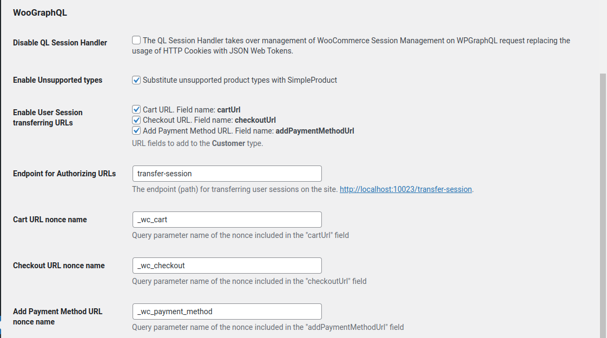
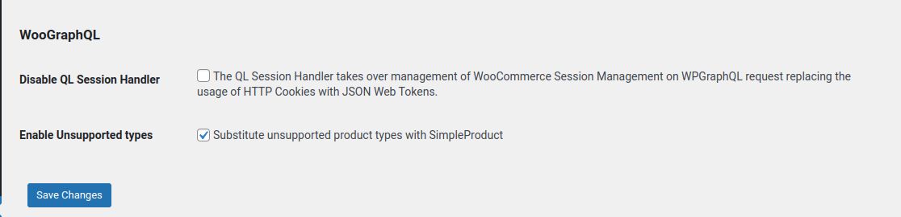

# WooGraphQL Settings

The WooGraphQL settings tab on the WPGraphQL settings page provides several options to customize the behavior of the WooGraphQL plugin. Below is a detailed breakdown of each setting.

## Disable QL Session Handler

WooGraphQL comes with a custom WooCommerce User Session Handler called QL Session Handler, which extends the default WooCommerce session handler. The QL Session Handler uses JSON Web Tokens (JWT) instead of HTTP cookies for session identification. This setting allows you to disable the QL Session Handler and revert to the default WooCommerce session handler that uses HTTP cookies.

### Default WooCommerce Session Handler

The default WooCommerce User Session Handler is responsible for capturing cart and customer data for end-users and storing it temporarily in the WordPress database. It provides an HTTP cookie to the end-user's machine to keep track of this session, even if they aren't a registered member of the WordPress site. The session typically stays in the database for 14 days from its last save, after which it is deleted. The problem with HTTP cookies is that they typically cannot be used across multiple domains without complex configurations.

## Enable Unsupported types

The settings is simple to understand and likely to be enabled if you're using a WC extension that uses a product type that isn't support by WooGraphQL out-of-box. When enabled it will substitute the missing type with the SimpleProduct type. This way you can still use the product type and possibly pull what extra data you need from the `Product`'s `metaData` field.

## Enable User Session transferring URLs

This setting, when activated, enables WooCommerce Session-backed nonce generator and transfer session endpoint for passing a user's session from a client to the WordPress installation. The primary use of these nonces is to create authorizing URLs that enable the user to travel to the backend as if it were a part of the front-end application. This setting is disabled if the QL Session Handler is disabled as it required for nonce generation to work. 

The next four settings are all about customizing the names of different parts of the authorizing URL..

### Endpoint for Authorizing URLs

The endpoint (path) for transferring user sessions on the site. Defaults to `transfer-session`.

### Cart URL nonce name, Checkout URL nonce name, and Add Payment Method URL nonce name

The name of the nonce param for each respective URL. They have to be unique and cannot be identical.

Using these settings alone is very insecure. It's highly recommended that specific measures be taken on the client to further secure the WP backend and end-user's data.
## WooGraphQL Pro Settings

These settings allow you to enable or disable the GraphQL schema types, queries, and mutations for various WooCommerce extensions supported by WooGraphQL Pro. This is useful if you have one of the supported extensions installed and activated but don't need it exposed to the GraphQL API, keeping the schema lightweight.

### Pro License

Enter your official WooGraphQL Pro license key in this field to receive automatic updates for WooGraphQL Pro.

### Enable Bundle Products

Check this option to enable the GraphQL schema types, queries, and mutations for the "WooCommerce Product Bundles" extension.

### Enable Composite Products

Check this option to enable the GraphQL schema types, queries, and mutations for the "WooCommerce Composite Products" extension.

### Enable Product Add-ons

Check this option to enable the GraphQL schema types, queries, and mutations for the "WooCommerce Product Add-ons" extension.

### Enable Subscriptions

Check this option to enable the GraphQL schema types, queries, and mutations for the "WooCommerce Subscriptions" extension.

**Note**: If a specific WooCommerce extension is not installed and activated, its respective setting will be auto-disabled.
