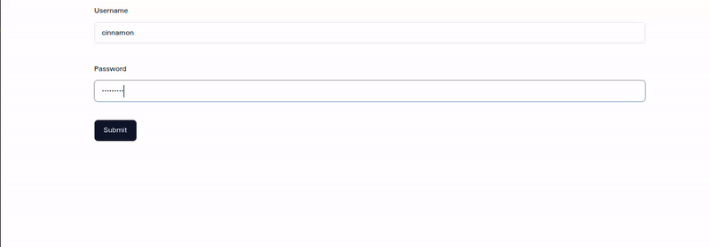
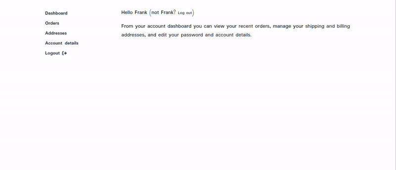
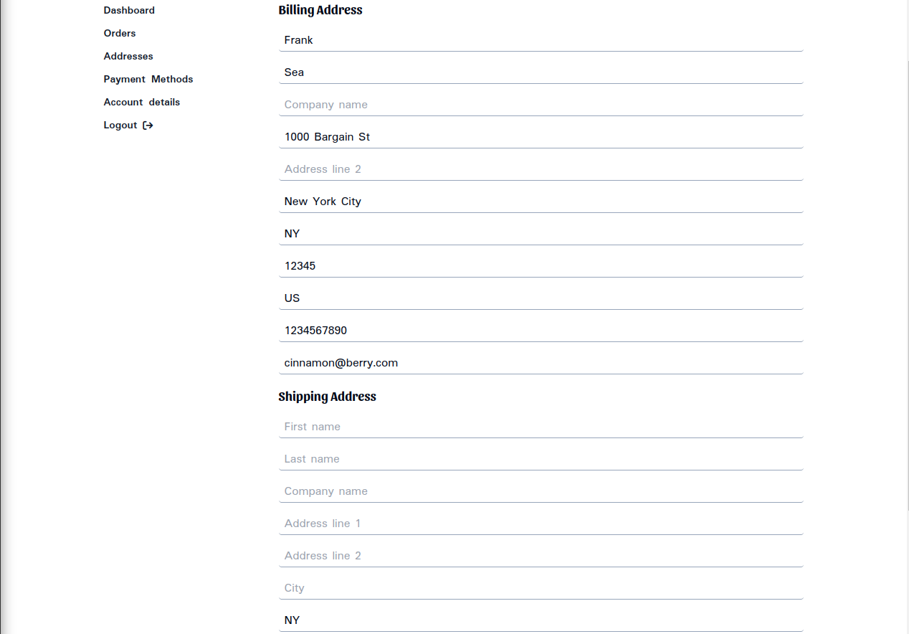
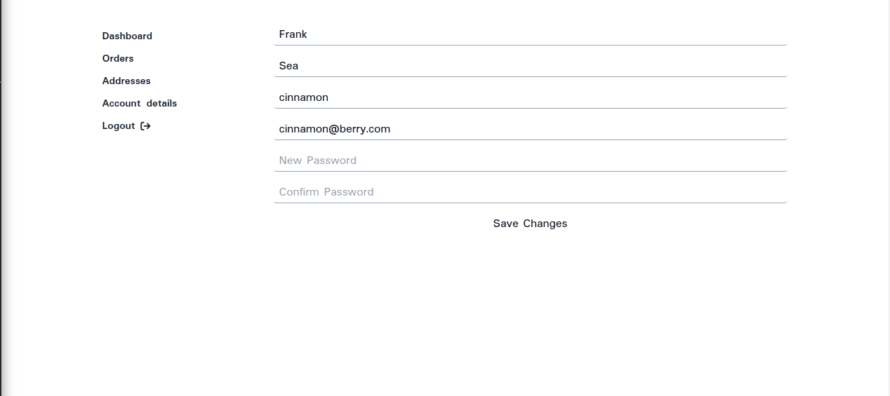

# Using Customer Data + Mutations

This section of the documentation will guide you through the process of creating a clone of WooCommerce's user account pages using React.js and the WooGraphQL API. This demonstration will provide a comprehensive understanding of how to use the `customer` query and `updateCustomer` mutation.

Before proceeding, it is assumed that you have already gone through and studied the code samples of the following documentation:
- [Handling User Session and Using Cart Mutations](handling-user-session-and-using-cart-mutations.md)
- [Using Order Data](using-order-data.md)

Code samples through this section with reference components/files defined in one of the those two sections.

## Application Overview

The application we're going to build will start with a login page. Upon successful login, the user will be directed to the account dashboard. The account page will consist of a navigation bar and main content area. The navigation bar will include links to the following sections:

- Dashboard
- Orders
- Addresses
- Account Details
- Logout

Let's go over what each of these sections will do:

- **Dashboard**: This page will display a welcome message to the authenticated user.
- **Orders**: This page will display a list of the user's orders. When an order is selected, more details about the selected order will be displayed.
- **Addresses**: This page will display forms for editing the user's billing and shipping addresses. Upon form submission, the `updateCustomer` mutation will be executed to save the changes on the server.
- **Account Details**: This page will display a form for updating the user's `firstName`, `lastName`, `displayName`, `email`, and `password`. Upon form submission, the `updateCustomer` mutation will be executed to save the changes on the server.
- **Logout**: Clicking this link will delete the user's credentials and return them to the login page.

The next section will just jump right into defining the individual components while never really turning upon the application root. This is because you, the developer, actually have a lot of wiggle room when it comes to routing and application structure. The only requirement is that all the component used are wrapped by the same `SessionProvider` instance.

## Login Page

Our login page will be a simple form with fields for an email address and password. When the form is submitted, we'll use the `login` mutation to authenticate the user. If the login is successful, we'll store the user's credentials and redirect them to the dashboard.

Here's what the code for our login page might look like:

```jsx
import React, { useState, useEffect } from 'react';
import { useSession } from './SessionProvider';

function LoginPage() {
  const [username, setUserName] = useState('');
  const [password, setPassword] = useState('');
  const { login, customer } = useSession();

  const handleLogin = (event) => {
    event.preventDefault();
    login(username, password);
  }
  
  useEffect(() => {
    if (customer?.id && customer.id !== 'guest') {
      // Redirect to account page.
      window.location.href = `${process.env.APP_URL}/account`;
    }
  }, [customer])

  return (
    <form onSubmit={handleLogin}>
      <input
        type="text"
        value={email}
        onChange={(e) => setEmail(e.target.value)}
        placeholder="Enter Username or Email"
        required
      />
      <input
        type="password"
        value={password}
        onChange={(e) => setPassword(e.target.value)}
        placeholder="Enter Password"
        required
      />
      <button type="submit" disabled={loading}>
        Log In
      </button>
      {error && <p>Error: {error.message}</p>}
    </form>
  );
}

export default LoginPage;
```

In this code, we're using the `login` callback from the `SessionProvider` to execute our `login` mutation. When the form is submitted, we call the `login` function with our form values as variables. If the login is successful, we can save the user's credentials and redirect them to the dashboard. If there's an error, we display the error message.

## Dashboard Page

The dashboard page will display a welcome message to the authenticated user. We'll use the `customer` object, fetched in our `login` mutation and stored in the `SessionProvider`, to fetch the user's details. Here's what the code for our dashboard page might look like:

```jsx
import React, { useEffect } from 'react';
import { useSession } from './SessionProvider';

function DashboardPage() {
  const { customer, logout, fetching } = useSession();
  useEffect(() => {
    if (fetching) {
      return;
    }

    if (!customer?.id || customer.id === 'guest') {
      // redirect to login
      window.location.href = `${process.env.APP_URL}/login`;
    }
  }, [customer]);

  if (fetching) {
    return <h1>Loading...</h1>;
  }

  if (!customer) {
    return null;
  }

  const {
    firstName,
    displayName,
  } = customer as Customer;

  const name = firstName || displayName;

  return (
    <>
      <p className="mb-4">
        {`Hello ${name} (not ${name}? `}
        <button
          type="button"
          className="bg-transparent text-sm text-cello m-0 p-0 whitespace-nowrap hover:text-wedgewood transition-colors duration-500 hover:outline-none"
          onClick={() => logout()}
        >
          Log out
        </button>
        )
      </p>
      <p>
        {"From your account dashboard you can view your "}
        <a href="/account/orders">recent orders</a>
        {", manage your "}
        <a href="/account/addresses">shipping and billing addresses</a>
        {", and " }
        <a href="/account/details">edit your password and account details</a>
        .
      </p>
    </>
  );
}

export default DashboardPage;
```



This code is rather simple. We display a welcome message with links to the other account pages. If the user is not authenticated, they are redirected back to login.

## Orders Page

The orders page will display a list of the user's orders. When an order is selected, more details about the selected order will be displayed. We'll use the `orders` field on the `customer` type to fetch the user's orders. Here's what the code for our orders page might look like:

```jsx
import React, { useState, useEffect } from 'react';
import { useSession } from './SessionProvider';

function OrdersPage() {
  const { customer, fetching } = useSession();
  const [selectedOrder, setSelectedOrder] = useState<Order|null>(null);
  const orders = (customer?.orders?.nodes || []) as Order[];

  useEffect(() => {
    if (fetching) {
      return;
    }
    if (!customer?.id || customer.id === 'guest') {
      // redirect to login
      window.location.href = `${process.env.APP_URL}/login`;
    }
  }, [customer]);

  if (fetching) {
    return <h1>Loading...</h1>;
  }

  if (!customer) {
    return null;
  }

  return (
    <div>
      <h1>Your Orders</h1>
      <ul>
        {orders.map((order) => (
          <li
            key={order.id}
            onClick={() => setSelectedOrder(order)}
          >
            Order #{order.databaseId} - {order.status} - {order.total}
          </li>
        ))}
      </ul>
      <hr />
      {selectedOrder && (
        <div>
          <h2>Order Details</h2>
          <p>Order ID: {selectedOrder.databaseId}</p>
          <p>Status: {selectedOrder.status}</p>
          <p>Total: {selectedOrder.total}</p>
          <p>Date: {new Date(selectedOrder.date as string).toLocaleDateString()}</p>
        </div>
      )}
    </div>
  );
}

export default OrdersPage;
```



In this code, we're using the `customer` object again. We're displaying the customer's `orders` and if one is selected this order is highlighted and displayed in more detail below.

## Addresses Page

The addresses page will display forms for editing the user's billing and shipping addresses. Upon form submission, the `updateCustomer` mutation will be executed to save the changes on the server. Here's what the code for our addresses page might look like:

```jsx
import React, { useState, useEffect } from 'react';
import { useSession } from './SessionProvider';

function AddressesPage() {
  const [billing, setBilling] = useState({});
  const [shipping, setShipping] = useState({});
  const { customer, updateCustomer, fetching } = useSession();

  useEffect(() => {
    if (!customer?.id || customer.id === 'guest') {
      // redirect to login
      window.location.href = `${process.env.APP_URL}/login`;
    }
  });

  useEffect(() => {
    customer?.billing && setBilling(customer.billing);
    customer?.shipping && setShipping(customer.shipping);
  }, [customer]);

  const handleBillingChange = (event) => {
    setBilling({ ...billing, [event.target.name]: event.target.value });
  };

  const handleShippingChange = (event) => {
    setShipping({ ...shipping, [event.target.name]: event.target.value });
  };

  const handleUpdateCustomer = async (event) => {
    event.preventDefault();

    updateCustomer({ billing, shipping });
  };

  if (!customer) {
    return null;
  }

  return (
    <form onSubmit={handleUpdateCustomer} style={{ display: 'flex', flexDirection: 'column' }}>
      <h1>Billing Address</h1>
      <input
        type="text"
        name="firstName"
        value={billing.firstName}
        onChange={handleBillingChange}
        placeholder="First name"
        required
      />
      <input
        type="text"
        name="lastName"
        value={billing.lastName}
        onChange={handleBillingChange}
        placeholder="Last name"
        required
      />
      {/* Repeat for other billing fields */}

      <h1>Shipping Address</h1>
      <input
        type="text"
        name="firstName"
        value={shipping.firstName}
        onChange={handleShippingChange}
        placeholder="First name"
        required
      />
      <input
        type="text"
        name="lastName"
        value={shipping.lastName}
        onChange={handleShippingChange}
        placeholder="Last name"
        required
      />
      {/* Repeat for other billing fields */}

      <button type="submit" disabled={fetching}>
        Save Changes
      </button>
    </form>
  );
}

export default AddressesPage;
```



Forgive me for skipping the other form fields but they should be pretty obvious from this point if you use the fields I created as reference. This is the first page with a form and you'll note the use of an `useEffect` to update the `shipping`, and `billing` state after changes to the `customer` object. This `useEffect` should capture both the initial values on mount, although they may not get displayed until the second render, and the changes after `updateCustomer` has been run.

## Account Details Page

The account details page will display a form for updating the user's `firstName`, `lastName`, `displayName`, `email`, and `password`. Upon form submission, the `updateCustomer` mutation will be executed by our `updateCustomer` callback to save the changes on the server. Here's what the code for our account details page might look like:

```jsx
import React, { useState, useEffect } from 'react';
import { useSession } from './SessionProvider';

function AccountDetailsPage() {
  const [details, setDetails] = useState({});
  const [confirmPassword, setConfirmPassword] = useState('');
  const { customer, updateCustomer, fetching } = useSession();

  useEffect(() => {
    if (fetching) {
      return;
    }

    if (!customer?.id || customer.id === 'guest') {
      // redirect to login
      window.location.href = `${process.env.APP_URL}/login`;
    }
  });

  useEffect(() => {
    setDetails({ ...customer })
  }, [customer])

  const handleChange = (event) => {
    setDetails({ ...details, [event.target.name]: event.target.value });
  };

  const handleSubmit = async (event) => {
    event.preventDefault();

    if (!!details.password && details.password !== confirmPassword) {
      alert('Passwords do not match');
      return;
    }

    updateCustomer({ ...details });
  };

  if (!customer) {
    return null;
  }

  return (
    <form onSubmit={handleSubmit} style={{ display: 'flex', flexDirection: 'column' }}>
      <input
        type="text"
        name="firstName"
        value={details.firstName}
        onChange={handleChange}
        placeholder="First name"
        required
      />
      {/* Repeat for other fields */}
      <input
        type="text"
        name="password"
        value={details.password}
        onChange={handleChange}
        placeholder="New Password"

      />
      <input
        type="text"
        name="firstName"
        value={confirmPassword}
        onChange={(event) => setConfirmPassword(event.target.value)}
        placeholder="Confirm Password"
      />

      <button type="submit" disabled={fetching}>
        Save Changes
      </button>
    </form>
  );
}

export default AccountDetailsPage

;
```



In this code, we're using the `updateCustomer` to execute our `updateCustomer` mutation when the form is submitted again. The logic pattern here is pretty identical to the `Addresses` page. You'll notice the continued lack of sophistication, with no little to no error handling. This is done to keep noise out these code samples. You, the reader, should consider these samples incomplete until you've included proper error handling.

## Where's the rest of the application?

With this the account pages are feature-complete minus some error-handling. You'll note there is a lack of error handling in the `SessionProvider`, as well. Consider it homework.

I'll also reiterate that I left out anything pertaining the application structure like navigation bars and the application root. That is because I wanted these code samples to be as framework-agnostic as possible.
This is also not quite a WooCommerce clone because it's missing the `Add Payment Methods` page. Implementing this page would be identical to the `orders` page, except the fields to be mapped to the listing are `customer.availablePaymentMethodsCC` or `customer.availablePaymentMethodsEC` instead of `customer.orders`. You'd also have to include a button to the `Add Payment Method` page on the WP Backend. See [Harmonizing With Wordpress](harmonizing-with-wordpress.md) for more details on how to get this URL.
You'll note these samples also don't take into account React server components. That is due to the common nature of most Account pages/components will have to be powered by client-side/runtime queries and not static generation/build-time queries - meaning they'll likely be executed after page load.

## Conclusion

In this section, we've seen how to use the WooGraphQL API to create a clone of WooCommerce's user account pages. We've used the `customer` query to fetch the user's details, the `orders` field on the `customer` type to fetch the user's orders, and the `updateCustomer` mutation to update the user's details and addresses. We've also seen how to handle user authentication with the `login` mutation and how to log out the user. It should be noted that this was all made possible by proper usage our `SessionProvider`.

With the completion of this section and all proceeding sections, you have been given an deep dive into the basic and intermediate usages of WooGraphQL. The following sections will be on WooGraphQL Pro functionality.
